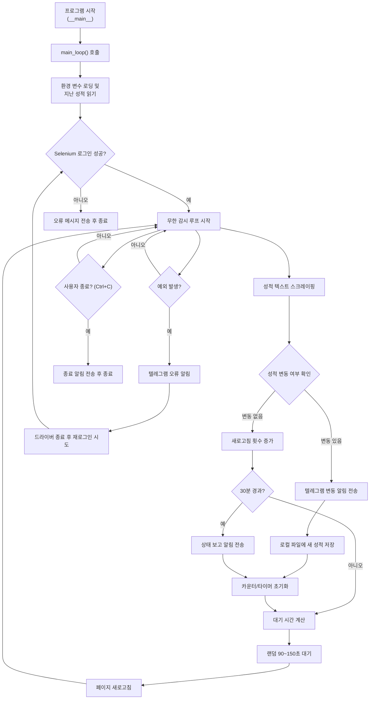

# 경북대 의대 성적 알림 봇 구조 개요

본 문서는 `knusc.py` 기반 프로그램의 전체 구조와 동작 순서를 한국어로 정리하여, 유지보수자와 신규 기여자가 쉽게 이해할 수 있도록 돕습니다.

## 시스템 구성 요약
- **환경 변수 로딩:** `.env` 파일을 통해 로그인 계정과 텔레그램 봇 정보를 불러옵니다.
- **주요 상수:** 로그인 페이지, 성적 페이지 URL과 최근 성적을 보관하는 로컬 파일 경로를 정의합니다.
- **알림 모듈:** `send_telegram_message` 함수가 텔레그램 API와 통신하여 알림을 전송합니다.
- **자동화 모듈:** `login_and_go_to_grades` 함수가 Selenium을 이용해 로그인 및 성적 페이지 이동을 수행합니다.
- **데이터 수집:** `scrape_grade_text` 함수가 성적표 영역 텍스트를 추출합니다.
- **상태 보존:** `read_last_grade` / `write_last_grade` 함수가 최근 성적 스냅샷을 로컬 파일로 관리합니다.
- **메인 루프:** `main_loop`가 전체 흐름을 제어하며 주기적으로 성적 변동을 감지하고 알림/보고를 수행합니다.

## 프로그램 동작 흐름 (Mermaid)

## 주요 함수 상세
### `send_telegram_message(message)`
- 텔레그램 봇 API (`https://api.telegram.org/bot.../sendMessage`)와 통신합니다.
- 예외 발생 시 오류 내용을 콘솔에 출력합니다.

### `login_and_go_to_grades()`
- 크롬 드라이버 옵션을 설정하고 로그인 페이지 진입 후 자격 증명을 입력합니다.
- 로그인 성공 시 성적 페이지로 이동한 뒤 `webdriver.Chrome` 인스턴스를 반환합니다.
- 실패하면 드라이버를 종료하고 `None`을 반환합니다.

### `scrape_grade_text(driver)`
- `record-list` 클래스를 가진 요소를 찾아 텍스트를 추출합니다.

### `read_last_grade()` / `write_last_grade(text)`
- 최근 성적 스냅샷을 `last_grade.txt`에 저장/불러오는 유틸리티입니다.
- 파일이 없을 경우 빈 문자열을 반환하여 첫 실행 여부를 판단합니다.

### `main_loop()`
- 프로그램 진입점으로, 실행 시 초기 메시지를 전송하고 Selenium 세션을 구성합니다.
- 성적 변동 감지, 상태 보고(30분 주기), 랜덤 대기(봇 탐지 회피), 예외 발생 시 재로그인 로직을 포함합니다.

## 예외 및 복구 전략
- **세션 만료/오류:** 예외 발생 시 텔레그램으로 보고 후 드라이버를 재시작합니다.
- **재로그인 실패:** 10분 간 대기 후 재시도합니다.
- **강제 종료:** 사용자가 Ctrl+C 입력 시 종료 메시지를 전송하고 드라이버를 정리합니다.

## 데이터 및 파일 관리
- `last_grade.txt`: 최근 확인한 성적표 텍스트를 저장하여 변동 여부를 판단하는 기준으로 사용합니다.
- `.env`: 로그인 정보 및 텔레그램 토큰/채팅 ID를 저장합니다.

## 보안 유의사항
- `.env` 파일은 버전 관리에서 제외하여 자격 증명 유출을 방지해야 합니다.
- 공용 환경에서 실행 시 헤드리스 모드 활성화 및 추가 보안 조치를 고려합니다.

## 유지보수 팁
- 사이트 구조 변경 시 `By.ID("userid")`, `By.ID("passwd")`, `By.CLASS_NAME("record-list")` 등의 선택자가 유효한지 반드시 확인합니다.
- 텔레그램 토큰 혹은 채팅 ID가 변경된 경우 `.env` 파일을 즉시 갱신하십시오.
- Selenium 크롬 드라이버 버전이 크롬 브라우저와 호환되는지 수시로 점검합니다.

